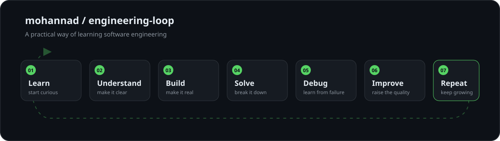
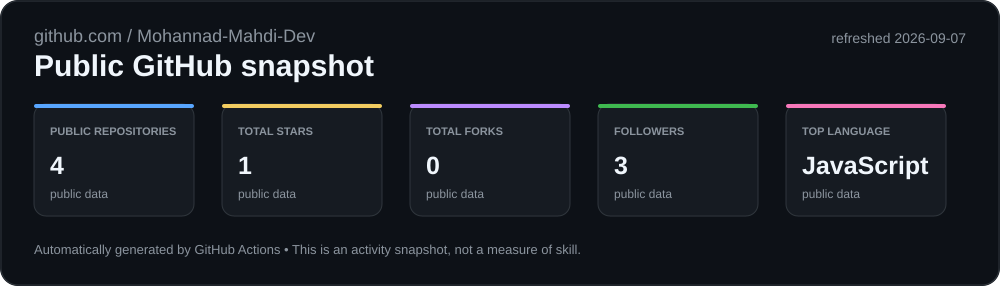
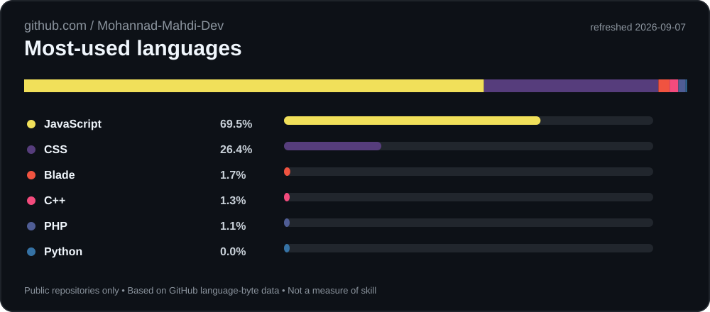
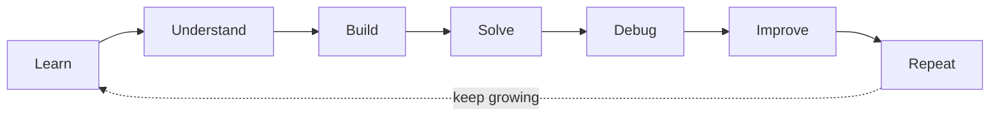

# Hi, I'm Mohannad Mahdi

**Information Technology student focused on software engineering, problem solving, and building practical applications.**

> **My approach:** understand the problem, build a clear solution, test it, debug it, and improve it.

## About Me

I am an Information Technology student building a practical foundation in software engineering. My current work combines programming fundamentals, algorithms, web applications, REST APIs, database-backed systems, documentation, and structured problem solving.

I value explainable implementations over impressive labels. I am still learning, but I learn through real projects, repeated practice, and deliberate improvement.

## Selected Work

| Project | Focus | Evidence |
|---|---|---|
| Mahand Developer Portfolio *(private repository)* | Local-first portfolio platform with a Next.js frontend, Laravel backend, and MySQL-oriented data layer. | Application boundaries, REST/API concepts, authentication and authorization concepts, documentation, and local development workflows. |
| [Programming Roadmap](https://github.com/Mohannad-Mahdi-Dev/programming-roadmap) | A structured path from programming foundations and algorithms to C++ exercises. | Problem decomposition, flowcharts, implementation practice, and continuous learning. |
| [Electronic Store Project](https://github.com/Mohannad-Mahdi-Dev/electronic-store-project) | Academic/team e-commerce web application. | Laravel, Blade, JavaScript, Tailwind, Vite, MySQL, MVC structure, and collaboration. |

## Skills & Technologies

### Languages and Frameworks

  
  
  
  
  
  
  
  

### Databases, Development Tools, and Workflow

  
  
  
  
  
  
  
  
  

| Evidence level | Current positioning |
|---|---|
| **Working with** | C++, PHP/Laravel, JavaScript, TypeScript, React, Next.js, MySQL, Git, GitHub, REST API concepts, and technical documentation. |
| **Practicing** | Algorithms, data structures, problem decomposition, application architecture, testing concepts, authentication, authorization, and containerized workflows. |
| **Exploring** | Python, AI/RAG, cybersecurity, blockchain, advanced software architecture, and maintainability. |

The badges are a visual index of technologies used or practiced in my projects. They are not claims of mastery.

## GitHub Activity

The following cards are generated automatically from public GitHub data by this profile repository's GitHub Actions workflow. They show activity and repository composition, not skill level.

  
  

### Profile Views

The badge above displays an aggregate profile-view count only. It does not display visitor names to profile viewers. The underlying counter project documents that GitHub's image proxy prevents it from receiving a visitor's GitHub username, browser user agent, or IP address.[1]

## Engineering Loop

**Plain-text fallback:** Learn → Understand → Build → Solve → Debug → Improve → Repeat.

## Currently Exploring

| Area | Honest description |
|---|---|
| Python and AI/RAG | Learning and building practical experiments; not presenting myself as an AI Engineer. |
| Cybersecurity | Developing awareness of secure application practices; not claiming advanced security expertise. |
| Blockchain | Exploring the concepts and ecosystem; not claiming professional blockchain experience. |
| Architecture and maintainability | Improving how I separate application boundaries, document decisions, and verify changes. |

## Contact and Professional Links

- [GitHub](https://github.com/Mohannad-Mahdi-Dev)
- **LinkedIn:** profile link will be added when the personal URL is available.
- **Portfolio website:** coming soon.

I am open to learning opportunities, internships, junior software engineering roles, and constructive conversations about practical software development.

---

### References

[1]: https://github.com/antonkomarev/github-profile-views-counter "GitHub Profile Views Counter documentation"
