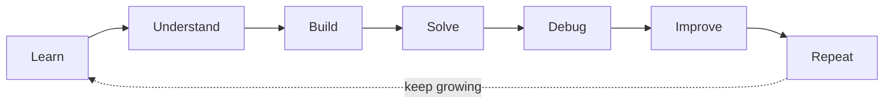

<div align="center">

# Hi, I'm Mohannad Mahdi

**Fourth-year Information Technology student focused on software engineering, problem solving, and building practical applications through continuous learning.**

[](https://github.com/Mohannad-Mahdi-Dev)

</div>


> **My signature:** I learn by understanding, building, solving, debugging, and improving—not by presenting myself as finished.

## The Story Behind the Work

I am building my software engineering foundation through practical projects and structured problem solving. I enjoy breaking complex problems into smaller, understandable parts, then turning the result into code that I can test, explain, and improve.

My work currently shows three connected parts of that journey: a local-first portfolio platform kept in a private repository, a C++ and algorithms learning roadmap, and an academic/team web application for an electronics store [2] [3].

## What I Build

| Project | What I built | What it shows | Status |
|---|---|---|---|
| Mahand Developer Portfolio (private repository) | A local-first portfolio platform organized around a Next.js frontend, Laravel backend, and MySQL-oriented data layer. | Application boundaries, REST/API concepts, authentication and authorization concepts, documentation, and local development workflows. | Implemented locally; staging/production is not claimed. |
| [Programming Roadmap](https://github.com/Mohannad-Mahdi-Dev/programming-roadmap) | A step-by-step path from programming foundations and algorithms to C++ exercises. | Learning through practice, problem decomposition, flowcharts, and translating logic into code. | Active learning repository with completed and progressing sections [2]. |
| [Electronic Store Project](https://github.com/Mohannad-Mahdi-Dev/electronic-store-project) | An academic/team e-commerce web application using Laravel, Blade, JavaScript, CSS/Tailwind, Vite, and MySQL. | Practical web development, MVC structure, database-backed features, and collaboration. | Academic/team project; documentation is being refined [3]. |

## My Toolkit

### Working With

<a href="https://github.com/tandpfun/skill-icons">
  
</a>

The icon row is a quick visual index, not a claim of mastery. The same tools are written below so the meaning remains clear when images are unavailable.

<p>
  
  
  
  
  
  
  
  
</p>

| Evidence level | Technologies and practices |
|---|---|
| **Working with** | C++, PHP/Laravel, REST API concepts, Next.js, React, TypeScript, MySQL, Git, GitHub, Docker, and technical documentation. |
| **Practicing** | Algorithms, data-structures fundamentals, problem decomposition, application architecture, testing concepts, authentication, and authorization. |
| **Exploring** | Python, AI/RAG, cybersecurity, blockchain, advanced software architecture, and maintainability. |

## GitHub Snapshot

This card is generated from public GitHub repository data by the profile repository's own GitHub Actions workflow. It is a quick activity snapshot, not a measure of skill or a substitute for project evidence.

<div align="center">
  
</div>

## How I Learn



**Plain-text fallback:** Learn → Understand → Build → Solve → Debug → Improve → Repeat.

The `programming-roadmap` repository reflects this progression directly: it moves from fundamentals and algorithms toward C++ implementation and repeated practice [2]. The public electronic-store repository adds the next layer: architecture, APIs, data, documentation, and local verification [3]. The portfolio implementation remains private.

## Engineering Mindset

I try to understand before coding, make the problem smaller before making the solution larger, and treat debugging as part of learning rather than as a sign of failure. I prefer a complete, explainable implementation over an impressive label, and I improve a project by revisiting its structure, documentation, tests, and setup experience.

## Currently Exploring

| Area | Honest description |
|---|---|
| Python and AI/RAG | Learning and building practical experiments; not presenting myself as an AI Engineer. |
| Cybersecurity | Developing awareness of secure application practices; not claiming advanced security expertise. |
| Blockchain | Exploring the concepts and ecosystem; not claiming professional blockchain experience. |
| Architecture and maintainability | Improving how I separate application boundaries, document decisions, and verify changes. |

## My Learning Journey

```text
Programming foundations
        ↓
Algorithms and problem solving
        ↓
C++ implementation practice
        ↓
Web applications and REST APIs
        ↓
Architecture, testing, and maintainability
        ↓
Further exploration in AI, security, and other areas
```

## Let's Connect

- [GitHub](https://github.com/Mohannad-Mahdi-Dev)

I am still learning, but I am not learning passively. I am building the path by working on real projects, facing problems, correcting mistakes, and repeating the process.

---

### References

[2]: https://github.com/Mohannad-Mahdi-Dev/programming-roadmap "Programming Roadmap repository"
[3]: https://github.com/Mohannad-Mahdi-Dev/electronic-store-project "Electronic Store Project repository"
